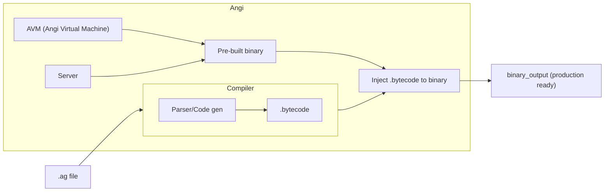

# Angi

## What?

- A scripting language lua-like, simple, fast, static-typed.
- A generate tool that generate backend-service code (transpile, meta programming?).
- Declarative backend language (or framework???)

## Why?

- I love the simplicity of lua, but I want static-type.
- I want write a server with minimal effort. Everything is built-in, hyper extendable.

## Architecture

### Flow

## Acknowledgement

- I learn how to write a lexer from [Gleam Project](https://github.com/gleam-lang/gleam)
